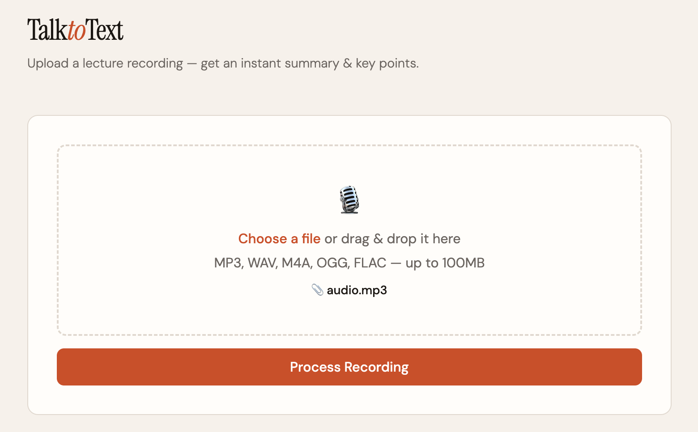

# talk to text
A website for uploading audio and getting transcriptions, summaries, and key points.

Pick an audio file, upload it, and get a readable transcript with a concise abstract summary and key points extracted from your audio. Perfect for lectures, meetings, or any long recordings.

## preview

## about
A hackathon project that I didn't get the chance to finish.

Currently running on “out of credits” mode, oopsies!
